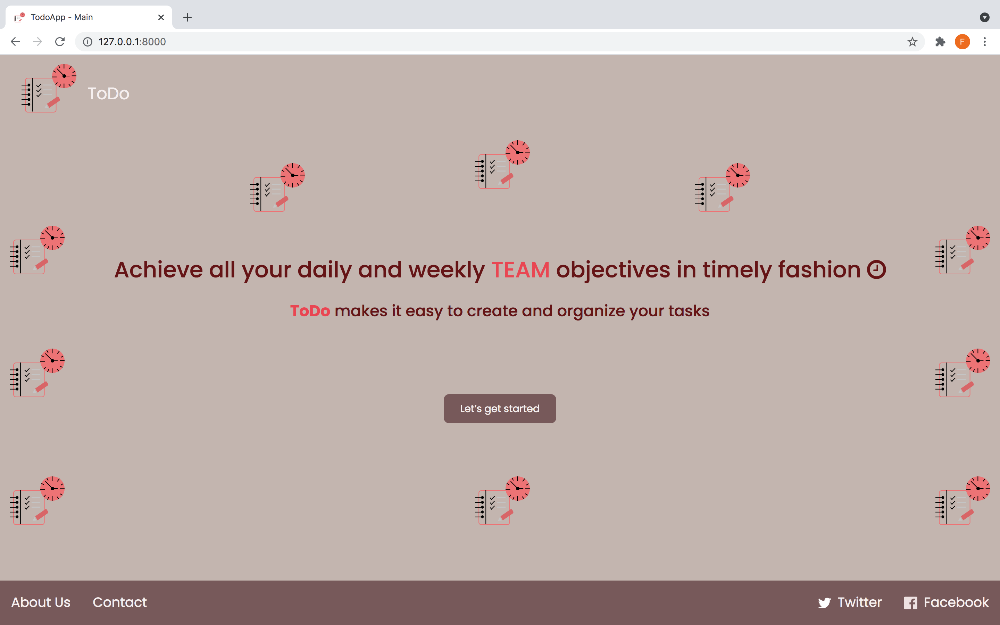
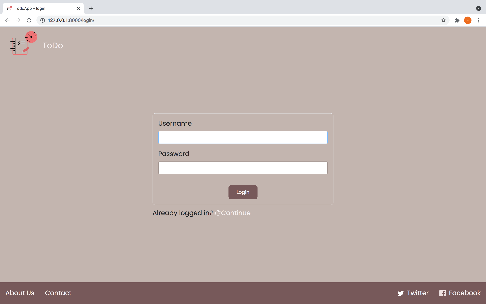
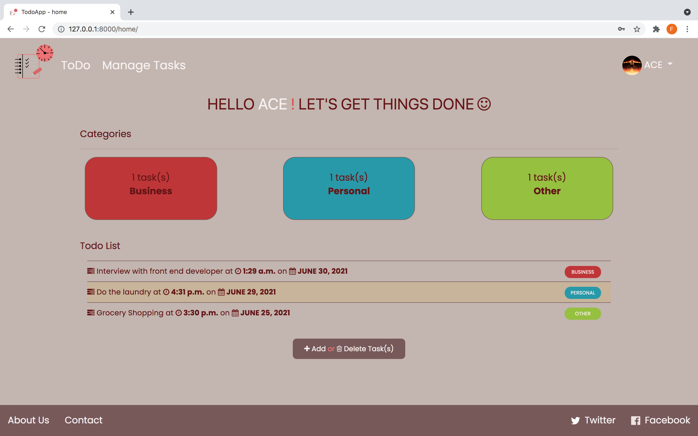

<h1> TODO LIST APP</h1>

A <strong>TODO LIST</strong> web application which makes it easy for you and your team to create and organize your tasks. 

This helps you to achieve all your daily and weekly objectives in timely fashion :slightly_smiling_face:.

<li>
The interface for this ToDo List application was created using the FIGMA design tool 
 </li>
<li> You can find the link to the figma design <a href="https://www.figma.com/proto/uiQbfkPQcVcliXj3ujhzV7/ToDo-App-prototype?page-id=0%3A1&node-id=3%3A9&viewport=244%2C301%2C0.13127148151397705&scaling=scale-down"> here </a> </li>

Here are some screenshots of the web application:

Base page:  

Login page:  

Homepage:  

Manage Tasks Page:   
 <li> To delete a task, click the checkbox and then click the trash icon.</li>
 <li>Note:You cant delete multiple tasks at once</li>

 
Profile Page:  

