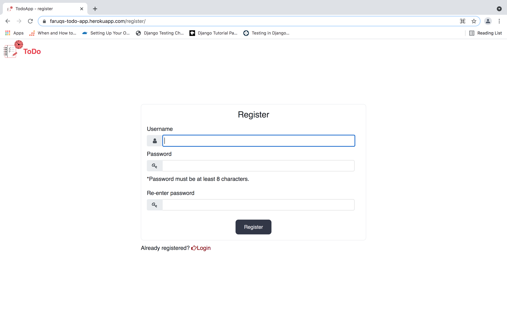
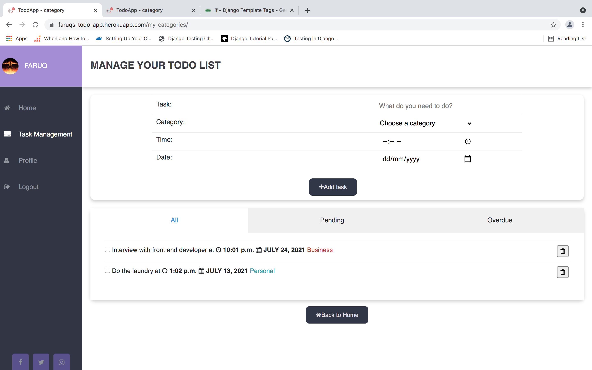

# TODO LIST APP

A <strong>TODO LIST</strong> web application with responsive UI which makes it easy for you to create and organize your tasks. 

This helps you to achieve all your daily and weekly team objectives in timely fashion :slightly_smiling_face:.

## App Usage
- The web application has been deployed to heroku server so that you can have a full user experience of the web application .<a href="https://faruqs-todo-app.herokuapp.com/"> Click here </a>

## Code Usage
- Clone the repository
- Create your environment 
 ```shell
       python3 -m venv env
 ```
 -Make migrations
  ```shell
       python3 manage.py makemigrations
 ```
  -Run the following command to run the code in development mode
  ```shell
       python3 manage.py runserver
 ```
       
## Preview

Base page:  

Login page:  

Register page:  

Homepage:  

Manage Tasks Page:   
 ```shell
 <li> To delete a task, click the checkbox and then click the trash icon </li>
 <li> Note:You cant delete multiple tasks at once </li>
 ```

Profile Page:  

